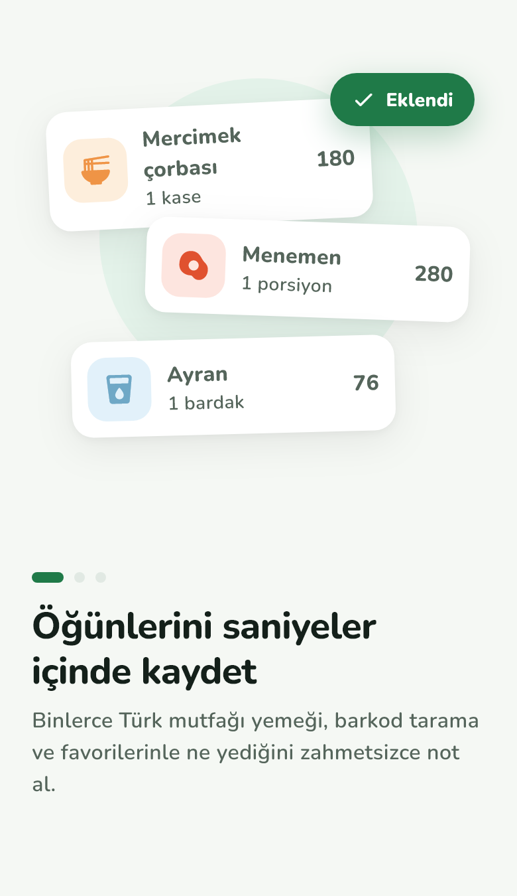
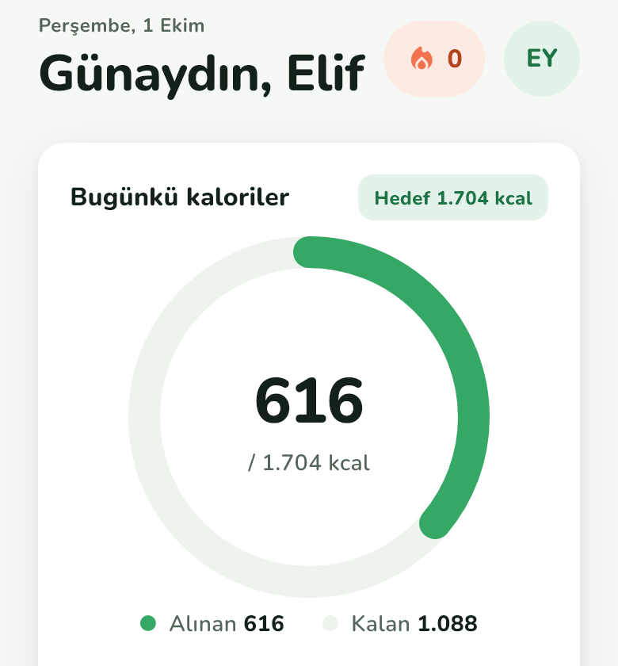
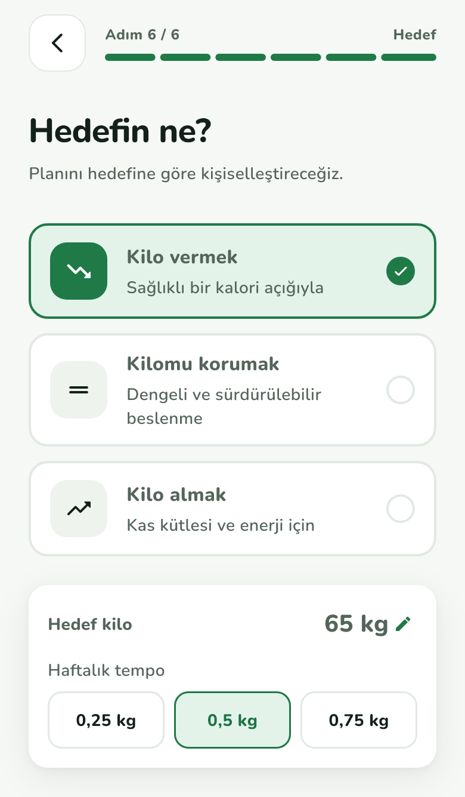
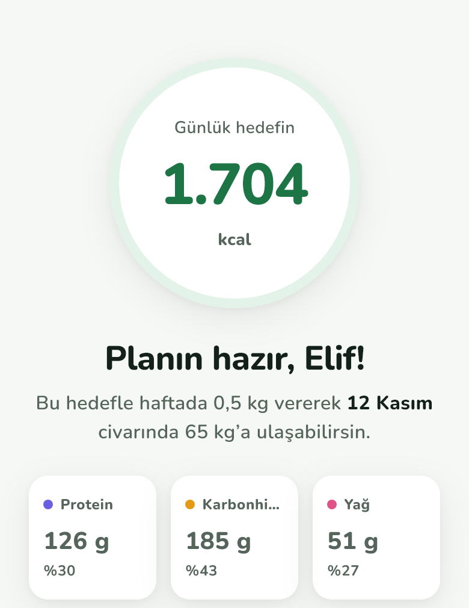
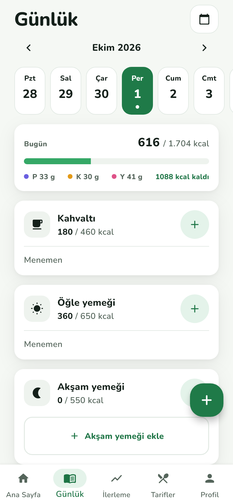
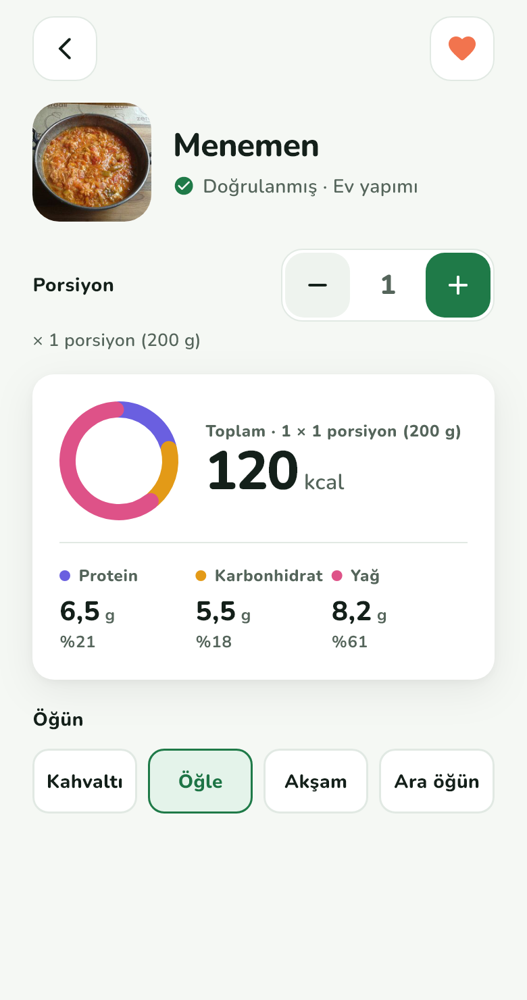
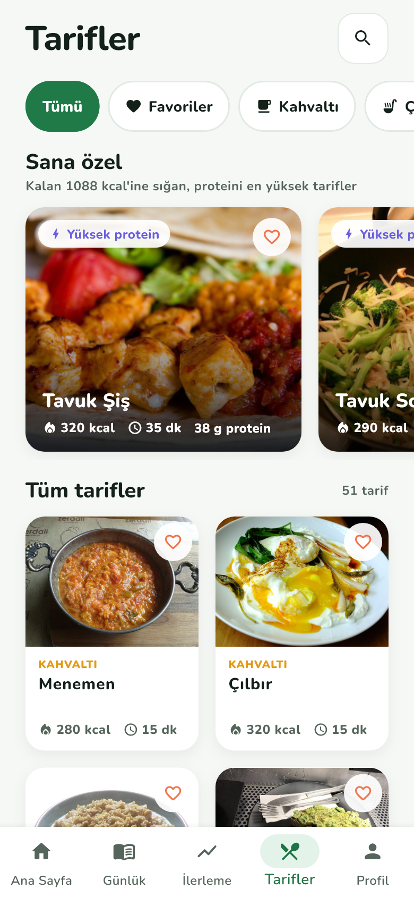
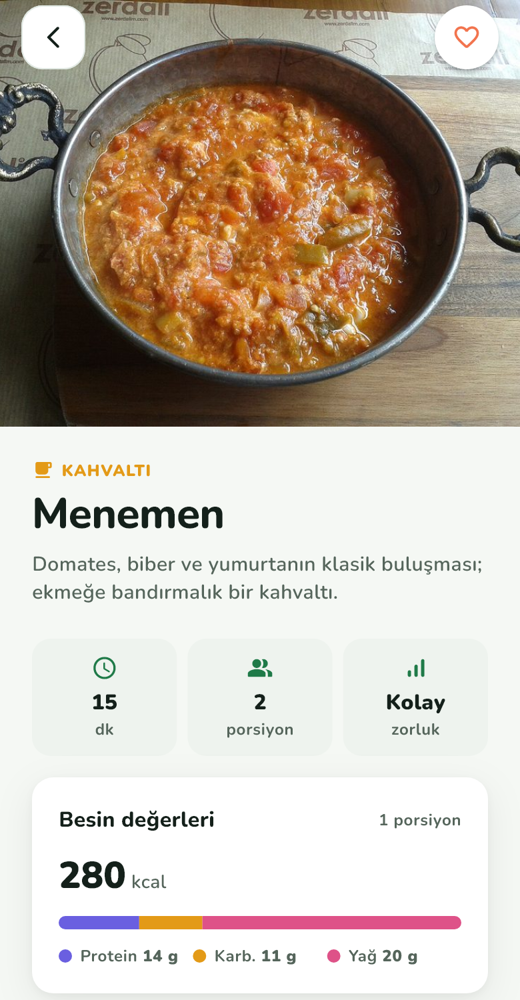
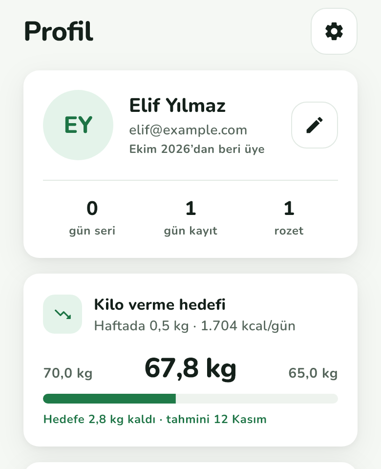

# Denge

**Denge**, Türk mutfağını tanıyan bir kalori ve beslenme takip uygulamasıdır. Amacı, ne yediğini zahmetsizce kaydetmeni, günlük kalori ve makro hedeflerini takip etmeni ve hedef kilona sağlıklı bir tempoyla ulaşmanı sağlamaktır. Mercimek çorbasından menemene, lahmacundan ayrana kadar alıştığın yemekleri bulur; barkod veya fotoğrafla tanır, sana uygun tarifler önerir.

Flutter ile geliştirilmiştir.

<p align="center">
  
  &nbsp;
  
</p>

## Neler yapabilir?

### Kişiye özel plan
Kısa bir kurulum sihirbazı cinsiyet, yaş, boy, kilo, aktivite düzeyi ve hedefini (kilo vermek, korumak ya da almak) sorar. Haftalık tempoyu sen seçersin. Denge, Mifflin-St Jeor formülüyle bazal metabolizmanı hesaplar, aktivite düzeyine göre günlük enerji ihtiyacını bulur ve buna göre günlük kalori, protein, karbonhidrat ve yağ hedeflerini belirler. Hedef kilona tahminen hangi tarihte ulaşacağını da gösterir.

<p align="center">
  
  &nbsp;
  
</p>

### Günlük ve kalori takibi
- Ana sayfada o gün aldığın ve kalan kaloriyi bir halka grafikte, makroları ilerleme çubuklarında görürsün.
- **Günlük** ekranında kahvaltı, öğle yemeği, akşam yemeği ve ara öğün ayrı ayrı listelenir. Her öğündeki yiyecekler porsiyonu ve kalorisiyle tek tek görünür.
- Yanlış eklediğin bir yiyeceği **sola kaydırarak silersin**; 4 saniye boyunca **"Geri al"** ile geri getirebilirsin. Bir yiyeceğe dokunarak porsiyonunu ya da öğününü değiştirirsin, kalori ve makrolar buna göre yeniden hesaplanır.
- Geçmiş günler arasında gezinince o günün kayıtlarını görürsün. Bütün kayıtlar cihazdaki veritabanında saklanır; uygulamayı kapatıp açınca hiçbir şey kaybolmaz.
- **Su takibi:** Bardaklara dokunarak gün içinde içtiğin suyu kaydedersin (bardak başına 250 ml, günlük hedef 2,5 L). Her günün suyu ayrı saklanır, yeni gün 0 bardakla başlar.

<p align="center">
  
  &nbsp;
  
</p>

### Yiyecek ekleme: arama, barkod ve fotoğraf
- **Arama:** Kategorilere ayrılmış (çorbalar, et yemekleri, kahvaltılıklar, tatlılar…) 200'ü aşkın Türk mutfağı yiyeceği ve içecek, fotoğraflarıyla birlikte.
- **Barkod tarama:** Kamerayla ürünün barkodunu okutursun. Ürün önce yerel katalogda, bulunamazsa [Open Food Facts](https://world.openfoodfacts.org/) veritabanında aranır.
- **Fotoğrafla tanıma:** Yemeğinin fotoğrafını çekersin. Google ML Kit görüntüyü etiketler, Denge en olası eşleşmeleri önerir ve hangisi olduğunu sen onaylarsın.
- **Kendi yiyeceğini ekle:** Aradığını bulamazsan "Yiyeceği kendin ekle" ile ad, marka, porsiyon, kalori, makrolar ve kategoriyi girip kaydedersin. Kendi yiyeceklerin sonraki aramalarda en üstte çıkar; üzerine basılı tutarak düzenleyebilir ya da silebilirsin. Barkodu tanınmayan bir ürünü de barkoduyla birlikte kaydedebilirsin; bir sonraki taramada doğrudan bulunur.
- Yiyecek detayında porsiyonu ayarlar, toplam kaloriyi ve makro dağılımını görür, hangi öğüne ekleneceğini seçersin.

### Tarifler
Hepsi fotoğraflı 51 sağlıklı Türk tarifi var. Tarifleri kahvaltı, çorba, ana yemek gibi kategorilere göre süzebilir, favorilerine ekleyebilirsin. **Sana özel** bölümü, o gün kalan kalorine sığan ve proteini en yüksek tarifleri öne çıkarır. Her tarifte süre, porsiyon, zorluk ve besin değerleri yer alır. Malzeme listesini işaretleyerek, hazırlanış adımlarını tamamladıkça dokunarak ilerlersin. Tek dokunuşla bir porsiyonu günlüğüne ekleyebilirsin.

<p align="center">
  
  &nbsp;
  
</p>

### İlerleme ve profil
- **İlerleme** ekranında kilonu kaydedersin. Bütün ölçümlerin saklanır; grafik son 7 ya da son 30 günü, her gün için o günün son ölçümüyle çizer. Hedefe ne kadar yaklaştığını, seri (streak) sayını ve su hedefini de buradan takip edersin.
- **Seri**, bugünden geriye doğru en az bir yiyecek kaydettiğin ardışık günlerin sayısıdır. Bugün henüz kayıt girmediysen seri bozulmaz, dünden itibaren sayılır.
- **Profil** ekranında kilo verme hedefin, başlangıç / güncel / hedef kilon, kayıt girdiğin gün sayısı ve kazandığın rozetler (İlk adım, 7 gün seri, Su ustası, Protein avcısı) yer alır. Rozetler her zaman gerçek kayıtlarından hesaplanır.

<p align="center">
  
</p>

### Ayarlar ve erişilebilirlik
- Açık ve koyu tema
- Dört kademeli yazı boyutu (Küçük, Normal, Büyük, Çok büyük)
- Animasyonları azaltma seçeneği
- Profilin, hedeflerin, tercihlerin ve favori tariflerin cihazda saklanır; uygulama yeniden açıldığında kaldığın yerden devam edersin.
- **Tüm verilerimi sil:** Onay verdiğinde günlük, su, kilo, kendi yiyeceklerin, profilin ve ayarların cihazdan kalıcı olarak silinir ve uygulama karşılama ekranına döner. Sildiğin kayıtlar 30 gün sonra veritabanından da tamamen temizlenir.
- Bütün sağlık ve beslenme verilerin yalnızca senin cihazında durur, hiçbir sunucuya gönderilmez.

## Kullanılan teknolojiler

| Alan | Paket |
| --- | --- |
| Durum yönetimi | `provider` |
| Yerel veritabanı (günlük, su, kilo, kendi yiyeceklerin) | `drift` + SQLite (`drift_flutter`) |
| Basit ayarlar ve profil | `shared_preferences` |
| Grafikler | `fl_chart` |
| Barkod tarama | `mobile_scanner` |
| Fotoğraf çekme / seçme | `image_picker` |
| Görüntü tanıma | `google_mlkit_image_labeling` |
| Ürün veritabanı (Open Food Facts) | `http` |

## Çalıştırma

```bash
flutter pub get
flutter run
```

Barkod tarama ve fotoğrafla tanıma kamera kullandığı için bu özellikleri gerçek bir Android ya da iOS cihazda denemen önerilir.

## Proje yapısı

```
lib/
├── data/       # Modeller, uygulama durumu, yiyecek ve tarif verileri, barkod ve fotoğraf tanıma
│   ├── db/            # Drift veritabanı, tablolar ve DAO'lar
│   ├── repositories/  # Veritabanı satırları ile uygulama modelleri arasındaki katman
│   └── stats/         # Günlük özet, seri ve kilo serisi hesapları
├── screens/    # Karşılama, kurulum, ana sayfa, günlük, arama, tarifler, ilerleme, profil, ayarlar
├── theme/      # Renkler ve açık/koyu tema
└── widgets/    # Ortak bileşenler
assets/
├── foods/      # Yiyecek fotoğrafları
├── recipes/    # Tarif fotoğrafları
└── fonts/      # Nunito yazı tipi
```
