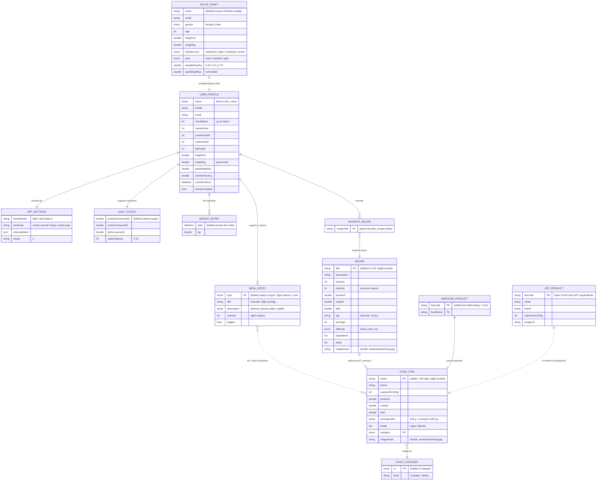
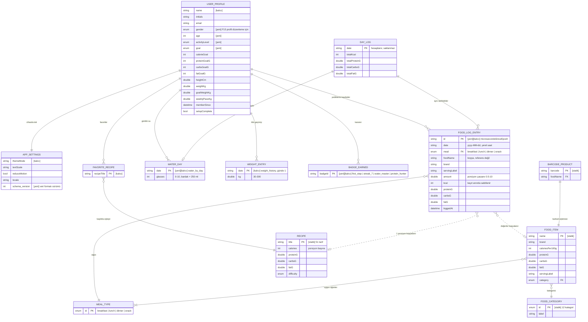

# Denge — ER Diyagramı

Uygulamanın sunucusu ve veritabanı yoktur. Bu diyagram, `lib/data/` altındaki Dart modellerini ve `shared_preferences` anahtarlarını **mantıksal varlıklar** olarak gösterir.
Kaynak: `lib/data/models.dart`, `lib/data/app_state.dart`, `lib/data/mock_data.dart`, ISKELET.md §4.2–4.3.

Saklanma biçimi lejantı (her varlığın üstündeki açıklamada):

- **[kalıcı]** `shared_preferences`'ta saklanır, uygulama yeniden açılınca geri gelir.
- **[bellek]** Sadece çalışırken bellekte durur; uygulama kapanınca kaybolur.
- **[statik]** Koda gömülü `const` veri (katalog); kullanıcı değiştiremez.
- **[yeni]** Henüz yok; ISKELET.md §7 aşamalarında eklenecek.

Çizgi tipi: düz çizgi (`──`) = gerçek ilişki/referans, kesikli çizgi (`┄┄`) = referans tutulmaz, değerler kopyalanır veya biri diğerinden üretilir.

---

## 1. Mevcut Durum (commit `e1e4922`)

Görsel: [`er_mevcut.png`](er_mevcut.png)

**Mevcut modeldeki sorunlar** (ISKELET.md §2 ile aynı):

- `MEAL_ENTRY` tek tek yiyecekleri tutmuyor; öğün başına yalnızca toplam kalori ve virgülle birleştirilmiş ad metni var. Bu yüzden kayıt silinemez veya düzenlenemez.
- `MEAL_ENTRY`, `DAILY_TOTALS` ve `WEIGHT_ENTRY` bellekte duruyor; tarih alanı yok, bu yüzden geçmiş günler gösterilemiyor.
- `FAVORITE_RECIPE` ve görsel yolları **ada/başlığa** bağlı: bir tarifin başlığı değişirse favori ve fotoğraf eşleşmesi kopar.

---

## 2. Hedef Model (MVP, Aşama 2–4 sonrası)

Görsel: [`er_hedef.png`](er_hedef.png)

**Hedef modelde önemli kararlar:**

- **`FOOD_LOG_ENTRY` katalog öğesine referans tutmaz.** Ad, kalori ve makroların kopyasını tutar, böylece katalogdaki bir değer düzeltilse bile geçmiş kayıtlar değişmez. Aynı nedenle Open Food Facts'ten gelen ürünler de katalogda saklanmadan doğrudan günlüğe yazılabilir.
- **`DAY_LOG` saklanmaz.** Aynı tarihli `FOOD_LOG_ENTRY` kayıtlarıyla `WATER_DAY` birleştirilerek hesaplanır. Ana sayfa ve Günlük ekranındaki toplamlar buradan gelir (F8).
- **Seri (streak) saklanmaz.** Kaydı olan `FOOD_LOG_ENTRY.date` değerlerinin ardışıklığından hesaplanır (F11). Bu yüzden `USER_PROFILE.streakDays` alanı kaldırılır.
- **`WATER_DAY` ve `WEIGHT_ENTRY` için anahtar tarihtir.** Aynı güne yapılan ikinci kayıt öncekinin üzerine yazılır.
- **`USER_PROFILE`'a cinsiyet, yaş, aktivite ve hedef eklenir.** F15'te kurulum sihirbazının mevcut değerlerle açılabilmesi için bunların saklanması gerekir; şu an sadece kurulum sırasında bellekte (`SETUP_DRAFT`) duruyorlar.
- **`MEAL_ENTRY` hedef modelde yok.** Ekranlarda öğün özeti gerekiyorsa `FOOD_LOG_ENTRY` kayıtlarından türetilir.

## 3. Saklama Anahtarları Eşlemesi

| Varlık | `shared_preferences` anahtarı | Biçim |
|---|---|---|
| APP_SETTINGS | `theme_mode`, `text_scale`, `reduce_motion`, `locale`, `schema_version` | düz değerler |
| USER_PROFILE | `setup_complete`, `user_*` (`user_name`, `user_calorie_goal`, …) | düz değerler |
| FAVORITE_RECIPE | `favorite_recipes` | StringList |
| FOOD_LOG_ENTRY | `log_entries` | JSON dizi |
| WATER_DAY | `water_by_day` | JSON nesne `{tarih: bardak}` |
| WEIGHT_ENTRY | `weight_history` | JSON dizi |
| BADGE_EARNED | `badges_earned` | StringList |
