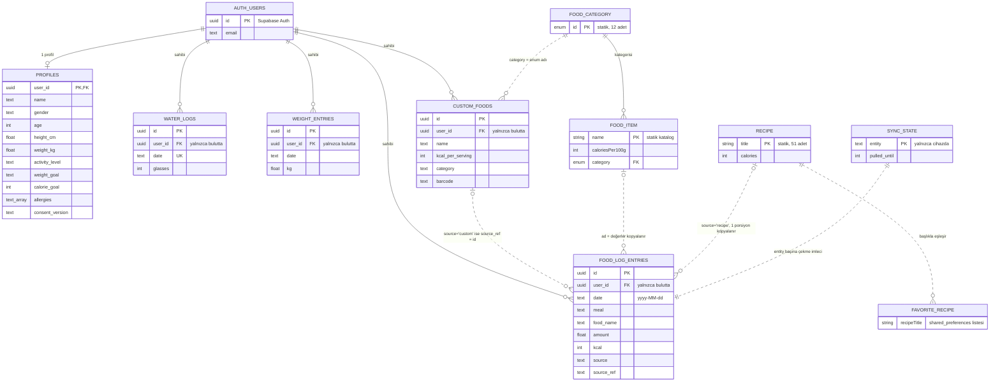
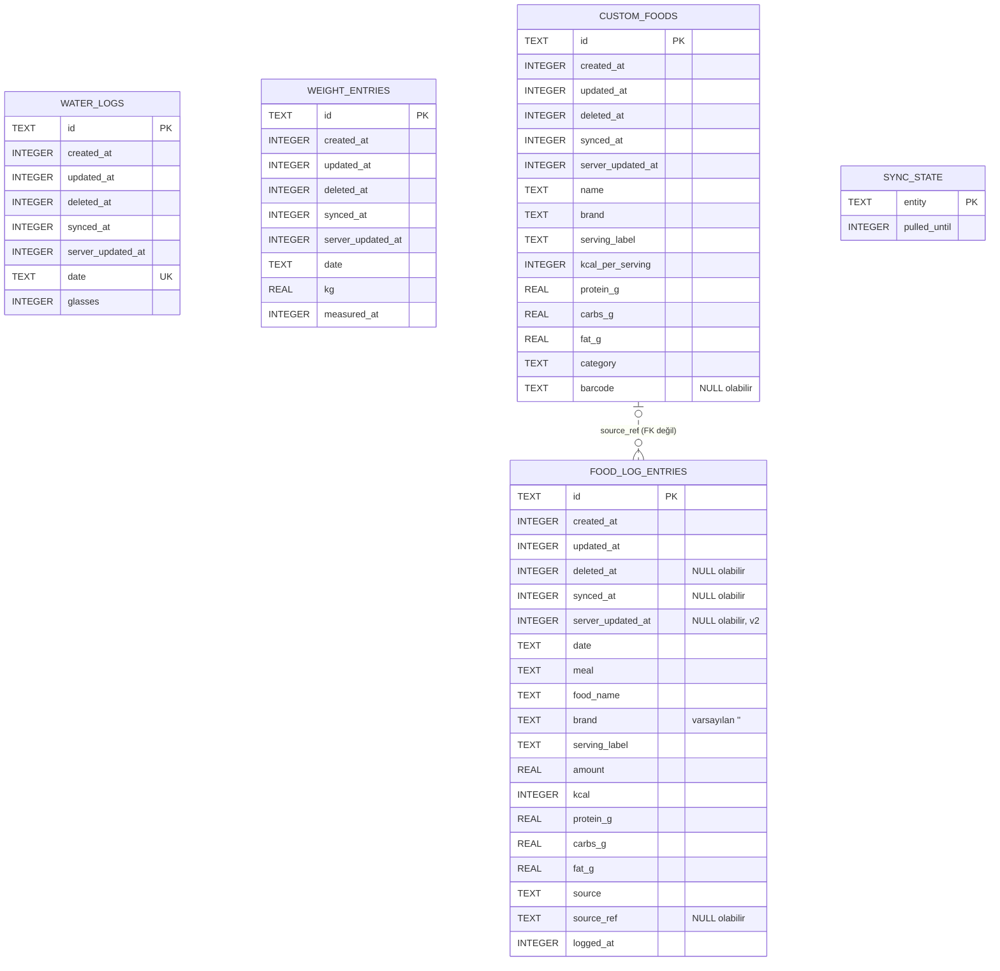

# Denge — Veri Tabanı ve ER Diyagramı

> **Kaynak:** `feat/profil-menuleri` dalı (`5ab5ab9`). Yerel veritabanı (Aşama 0–6) ve
> Supabase senkronu bu dalda. `main` dalında henüz veritabanı yok.
>
> Okunan dosyalar: `lib/data/db/tables.dart`, `lib/data/db/app_database.dart`,
> `supabase/migrations/*.sql`, `lib/data/app_state.dart`, `lib/data/reminders.dart`.

## 1. Genel bakış: veri nerede duruyor?

| Katman | Teknoloji | Ne tutuyor |
|---|---|---|
| **Cihaz veritabanı** | SQLite + drift, dosya `denge.sqlite`, şema **v2** | Günlük kayıtları, su, kilo, kendi yiyecekler, senkron imleci |
| **Cihaz tercihleri** | `shared_preferences` | Profil, hedefler, ayarlar, alerjiler, KVKK onayları, favori tarifler, bildirim ayarları |
| **Bulut** | Supabase (PostgreSQL) | Cihaz tablolarının kopyası + `profiles` tablosu. Her satır `user_id` ile kullanıcıya bağlı |
| **Statik katalog** | Dart kodu (`const`) | ~220 yiyecek, 12 kategori, 51 tarif, 5 barkod eşlemesi |

Uygulama her zaman cihazdaki veritabanından okur. İnternet gelince `SyncEngine` değişiklikleri
buluta gönderir ve buluttan yenilerini çeker.

---

## 2. ER diyagramı

### 2.1 Tüm sistem (mantıksal)

Görsel: [`er_genel.png`](er_genel.png)

**Çizgiler:** düz çizgi (`──`) = gerçek yabancı anahtar. Kesikli çizgi (`┄┄`) = veritabanında
yabancı anahtar yok, ilişki uygulama kodunda kuruluyor (değer kopyalanıyor veya ad/kimlikle eşleşiyor).

**Önemli ilişki notları**
- Cihazdaki SQLite'ta **hiç yabancı anahtar yok**. Cihazda tek kullanıcı olduğu için `user_id`
  sütunu da yok, kullanıcı bağlantısı yalnızca bulutta kuruluyor.
- `food_log_entries` katalog yiyeceğine veya tarife **referans vermez**. Ad, porsiyon, kalori ve
  makrolar kayıt anında kopyalanır, böylece katalog değişse de eski günler aynı kalır.
- `source_ref`, kaynağa göre farklı şey tutar: `barcode` ise barkod numarası, `custom` ise
  `custom_foods.id`. Bu yüzden gerçek bir yabancı anahtar olamaz.
- Buluttaki her tablo `auth.users`'a `ON DELETE CASCADE` ile bağlıdır. Hesap silinince bütün
  verisi de silinir.

### 2.2 Cihaz veritabanı (SQLite, şema v2)

Görsel: [`er_cihaz_sqlite.png`](er_cihaz_sqlite.png)

---

## 3. Cihaz veritabanı tabloları (SQLite)

Bütün zamanlar **UTC milisaniye** (`INTEGER`). `date` sütunları cihazın **yerel** gününe göre `yyyy-MM-dd`.

### 3.1 Ortak sütunlar (`SyncColumns` mixin)

`food_log_entries`, `water_logs`, `weight_entries` ve `custom_foods` tablolarının hepsinde bulunur.

| Sütun | Tip | Boş olabilir | Açıklama |
|---|---|---|---|
| `id` | TEXT | Hayır | **PK.** Cihazda üretilen UUID v4 |
| `created_at` | INTEGER | Hayır | Oluşturulma zamanı |
| `updated_at` | INTEGER | Hayır | Son değişiklik. Senkronda "son yazan kazanır" anahtarı |
| `deleted_at` | INTEGER | Evet | Doluysa kayıt silinmiş sayılır (yumuşak silme) |
| `synced_at` | INTEGER | Evet | Bu sürümün buluta en son ulaştığı an. `NULL` veya `updated_at`'ten eskiyse gönderilmesi gerekir |
| `server_updated_at` | INTEGER | Evet | Sunucunun bu satıra verdiği zaman (v2'de eklendi). Çekme imleci telefon saatine değil buna dayanır |

### 3.2 `food_log_entries`: Günlüğe eklenen her yiyecek

| Sütun | Tip | Boş | Varsayılan | Açıklama |
|---|---|---|---|---|
| *ortak sütunlar* | | | | §3.1 |
| `date` | TEXT | Hayır | | Yerel gün |
| `meal` | TEXT | Hayır | | `breakfast` / `lunch` / `dinner` / `snack` |
| `food_name` | TEXT | Hayır | | Kopya |
| `brand` | TEXT | Hayır | `''` | Kopya |
| `serving_label` | TEXT | Hayır | | Örn. `1 porsiyon (200 g)` |
| `amount` | REAL | Hayır | | Porsiyon çarpanı |
| `kcal` | INTEGER | Hayır | | `amount` porsiyonun toplam kalorisi, kayıt anında sabitlenir |
| `protein_g`, `carbs_g`, `fat_g` | REAL | Hayır | | Toplam makrolar |
| `source` | TEXT | Hayır | | `catalog` / `recipe` / `barcode` / `photo` / `custom` |
| `source_ref` | TEXT | Evet | | Barkod numarası veya `custom_foods.id` |
| `logged_at` | INTEGER | Hayır | | Eklenme anı, gün içi sıralama için |

**İndeksler:** `food_log_date_meal (date, meal)`, `food_log_date (date)`

### 3.3 `water_logs`: Günlük su

| Sütun | Tip | Boş | Açıklama |
|---|---|---|---|
| *ortak sütunlar* | | | §3.1 |
| `date` | TEXT | Hayır | **UNIQUE**, her gün için tek satır |
| `glasses` | INTEGER | Hayır | Bardak sayısı (hedef 10 × 250 ml) |

### 3.4 `weight_entries`: Kilo ölçümleri

| Sütun | Tip | Boş | Açıklama |
|---|---|---|---|
| *ortak sütunlar* | | | §3.1 |
| `date` | TEXT | Hayır | Yerel gün. Aynı gün birden fazla ölçüm olabilir, grafik günün son ölçümünü kullanır |
| `kg` | REAL | Hayır | Kilo |
| `measured_at` | INTEGER | Hayır | Ölçüm anı |

### 3.5 `custom_foods`: Kullanıcının kendi eklediği yiyecekler

| Sütun | Tip | Boş | Varsayılan | Açıklama |
|---|---|---|---|---|
| *ortak sütunlar* | | | | §3.1 |
| `name` | TEXT | Hayır | | |
| `brand` | TEXT | Hayır | `''` | |
| `serving_label` | TEXT | Hayır | | |
| `kcal_per_serving` | INTEGER | Hayır | | |
| `protein_g`, `carbs_g`, `fat_g` | REAL | Hayır | | Porsiyon başı |
| `category` | TEXT | Hayır | | `FoodCategory` enum adı |
| `barcode` | TEXT | Evet | | Tanınmayan barkod taramasından kaydedildiyse |

### 3.6 `sync_state`: Senkron imleci (yalnızca cihazda, v2)

| Sütun | Tip | Boş | Açıklama |
|---|---|---|---|
| `entity` | TEXT | Hayır | **PK.** Tablo adı, örn. `food_log_entries`, `profiles` |
| `pulled_until` | INTEGER | Hayır | O tablodan çekilen en büyük `server_updated_at` |

Bu tablo kullanıcı verisi değil, senkronun nerede kaldığını tutuyor. Bu yüzden ortak sütunları yok.

### 3.7 Şema sürümleri

| Sürüm | Değişiklik |
|---|---|
| v1 | 4 kullanıcı tablosu (`food_log_entries`, `water_logs`, `weight_entries`, `custom_foods`) |
| v2 | 4 tabloya `server_updated_at` sütunu eklendi, `sync_state` tablosu oluşturuldu |

Geçişler `stepByStep` ile yazılıyor. Şema dökümleri `drift_schemas/`, adımlar `app_database.steps.dart` içinde.

---

## 4. Bulut tabloları (Supabase / PostgreSQL)

Cihaz tablolarının aynısı, şu farklarla:
- `id` tipi `uuid`.
- Her tabloda `user_id uuid NOT NULL DEFAULT auth.uid()`, `auth.users(id)`'e **FK, ON DELETE CASCADE**.
- `synced_at` yok (sadece cihaza ait). `server_updated_at NOT NULL DEFAULT now_ms()`.
- Sütunlarda **CHECK** kısıtları var.

| Tablo | PK | Önemli kısıtlar |
|---|---|---|
| `food_log_entries` | `id` | `date` biçimi `^\d{4}-\d{2}-\d{2}$`. `meal` ∈ 4 öğün. `amount > 0`. `kcal`, makrolar ≥ 0. `source` ∈ 5 değer |
| `water_logs` | `id` | **UNIQUE (`user_id`, `date`)**. `glasses` 0–50 |
| `weight_entries` | `id` | `kg` 25–300 |
| `custom_foods` | `id` | `name` en az 2 karakter (boşluklar hariç). `kcal_per_serving` 0–5000. Makrolar ≥ 0 |
| `profiles` | `user_id` | Aşağıda |

### 4.1 `profiles`: Bulut profili (cihazda `shared_preferences`'ın karşılığı)

| Sütun | Tip | Boş | Kısıt / açıklama |
|---|---|---|---|
| `user_id` | uuid | Hayır | **PK + FK** → `auth.users`, cascade |
| `created_at`, `updated_at` | bigint | Hayır | |
| `server_updated_at` | bigint | Hayır | Sunucu damgası |
| `name`, `email` | text | Hayır | Varsayılan `''` |
| `gender` | text | Evet | `female` / `male` |
| `age` | integer | Evet | 13–100 |
| `height_cm` | double | Evet | 100–250 |
| `weight_kg` | double | Evet | 25–300 (2. migration ile eklendi) |
| `activity_level` | text | Evet | `sedentary` / `light` / `moderate` / `active` |
| `weight_goal` | text | Evet | `lose` / `maintain` / `gain` |
| `goal_weight_kg` | double | Evet | 30–300 |
| `weekly_pace_kg` | double | Evet | 0–2 |
| `calorie_goal` | integer | Evet | 0–6000 |
| `protein_goal_g`, `carbs_goal_g`, `fat_goal_g` | integer | Evet | 0–1000 |
| `allergies` | text[] | Hayır | Varsayılan `{}` |
| `allergy_note` | text | Hayır | Varsayılan `''` |
| `consent_version` | text | Evet | KVKK onay metni sürümü |
| `consent_at` | bigint | Evet | Onay anı |

`profiles` tablosunda `id` ve `deleted_at` yok: her kullanıcının tek profili var ve profil yumuşak silinmiyor.

### 4.2 İndeksler, tetikleyiciler, güvenlik

| Öğe | Ne yapıyor |
|---|---|
| `*_pull` indeksleri | 4 tabloda `(user_id, server_updated_at)`: "şu andan sonra değişenleri getir" sorgusu için |
| `sync_row_guard()` tetikleyicisi | Her INSERT/UPDATE'te `server_updated_at` damgalar. Eski `updated_at` ile gelen güncellemeyi **yok sayar** (son yazan kazanır). `user_id` ve `created_at` değiştirilemez |
| `profile_row_guard()` | Aynı kural, `profiles` için |
| **RLS** (satır düzeyi güvenlik) | 5 tabloda açık. Giriş yapmış kullanıcı yalnızca `user_id = auth.uid()` olan satırları görür, ekler, günceller. **DELETE izni yok** (yalnızca yumuşak silme). Anonim kullanıcı hiçbir şey göremez |
| `upsert_water(...)` RPC | Aynı gün iki cihazda farklı `id` ile oluşturulan su kaydını `(user_id, date)` üzerinden birleştirir |
| `delete_my_account()` RPC | Kullanıcıyı `auth.users`'tan siler, cascade ile bütün verisi gider |
| `now_ms()` | Sunucu saati, UTC ms |

---

## 5. `shared_preferences` anahtarları (cihaz)

| Grup | Anahtarlar |
|---|---|
| Ayarlar | `theme_mode`, `text_scale`, `reduce_motion`, `locale` |
| Profil | `setup_complete`, `user_name`, `user_email`, `user_initials`, `user_gender`, `user_age`, `user_height`, `user_weight`, `user_activity`, `user_goal_type`, `user_goal_weight`, `user_weekly_pace`, `user_member_since` |
| Hedefler | `user_calorie_goal`, `user_protein_goal`, `user_carbs_goal`, `user_fat_goal` |
| Sağlık / KVKK | `user_allergies`, `user_allergy_note`, `consent_version`, `consent_at`, `cloud_consent_version`, `cloud_consent_at` |
| Diğer | `favorite_recipes` (tarif başlıkları listesi), `notification_settings` (JSON) |
| Senkron / geçiş | `profile_updated_at`, `last_synced_at`, `weight_history_migrated` |

`notification_settings` JSON alanları: `mealReminders`, `waterReminders`, `weeklySummary`,
`breakfastMinutes`, `lunchMinutes`, `dinnerMinutes`, `waterIntervalHours`.

---

## 6. Saklanmayan, hesaplanan değerler

| Değer | Nereden hesaplanıyor |
|---|---|
| Günlük kalori ve makro toplamı | O günün `food_log_entries` satırları (`DailySummary`) |
| Seri (streak) | Kaydı olan günler (`currentStreak`) |
| Rozetler | Seri, su ve protein hedefi |
| Kilo grafiği | Her gün için son `weight_entries` ölçümü |

## 7. Dikkat edilecek noktalar

- **Favori tarifler** hâlâ başlığa göre saklanıyor ve buluta gitmiyor.
- **`profiles`, bulutta bir tablo ama cihazda tablo değil.** Cihazda `shared_preferences` içinde duruyor ve `ProfileSnapshot` ile iki taraf arasında çevriliyor.
- **Su kaydının `id`'si değişebilir.** Su kaydı buluta ilk gittiğinde sunucu aynı gün için başka bir `id` döndürebilir. Uygulama bu durumda sunucunun `id`'sini kullanır.
